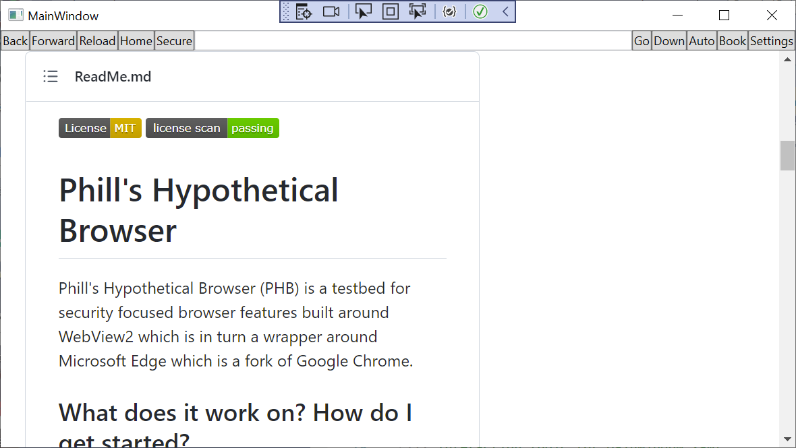

# Build Guide

To build PHB, it is necessary to follow the 
[current instructions for getting started with WebView2 on the Microsoft site](https://docs.microsoft.com/en-us/microsoft-edge/webview2/get-started/wpf)

## 0 Prerequisites

Since PHB is written in C#10 using .net6.0, the prerequisites for PHB are slightly higher:

1) [Visual Studio](https://visualstudio.microsoft.com/) 2022 or later.

2) [WebView2 Runtime](https://developer.microsoft.com/microsoft-edge/webview2), 
or any [Microsoft Edge Insider (preview) 
Channel](https://www.microsoftedgeinsider.com/download) (Beta, Dev, or Canary) 
installed on a supported operating system (OS). 

The currently supported OS list is Windows 11, Windows 10, Windows 8.1, and Windows 7.

## To run

Build and run PHB in Visual Studio by hitting the **F5** key.

